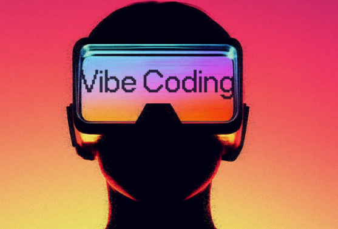

# 🚀 CodingVibes — Interactive Programming Roadmaps

<p align="center">
  
</p>

<p align="center">
  <strong>Master modern programming from Beginner to Elite — one roadmap at a time.</strong>
</p>

<p align="center">
  <a href="https://codingvibes.com">🌐 Live Site</a> •
  <a href="#-roadmaps-available">📚 Roadmaps</a> •
  <a href="#-contributing">🤝 Contribute</a> •
  <a href="#-tech-stack">⚙️ Tech Stack</a>
</p>

---

## 📖 About

**CodingVibes** is a free, open-source educational platform offering in-depth programming roadmaps. Each roadmap is structured into progressive levels — from absolute beginner to elite mastery — featuring:

- 📝 **Detailed concept explanations** with real-world analogies
- 💻 **Code snippets** for every topic
- ❓ **Practice questions** with revealable answers
- 🎯 **Progressive difficulty** — Beginner → Intermediate → Advanced → Expert

## 📚 Roadmaps Available

| Roadmap | Levels | Topics | Status |
|---------|--------|--------|--------|
| **Advanced C++** | 5 | C++11 through C++20, OOP, STL, Templates | ✅ Live |
| **Rust** | 7 | Ownership, Concurrency, Unsafe, Embedded | ✅ Live |
| **Core Java** | 4 | OOP, Collections, Streams, Concurrency | ✅ Live |
| **Spring Boot** | 4 | DI, REST APIs, Security, Microservices | ✅ Live |
| **Hibernate ORM** | 4 | JPA, Mappings, Caching, Optimization | ✅ Live |
| **Docker & K8s** | 4 | Containers, Orchestration, Networking | ✅ Live |
| **Microservices** | 4 | Patterns, Sagas, CQRS, Service Mesh | ✅ Live |
| **React** | 5 | Hooks, Fiber, Next.js, Microfrontends | ✅ Live |

## ⚙️ Tech Stack

- **Frontend:** React 18 + TypeScript
- **Routing:** React Router v6
- **Styling:** Tailwind CSS
- **Icons:** Lucide React
- **Build Tool:** Vite
- **Data:** JSON-based curriculum files

## 🛠️ Getting Started

### Prerequisites

- [Node.js](https://nodejs.org/) (v18+)
- npm or yarn

### Installation

```bash
# Clone the repository
git clone https://github.com/YOUR_USERNAME/CodingVibes.git
cd CodingVibes

# Install dependencies
npm install

# Start development server
npm run dev
```

The app will be running at `http://localhost:5173`.

### Build for Production

```bash
npm run build
```

## 📁 Project Structure

```
├── public/
│   ├── logo.png            # Brand logo
│   ├── ads.txt             # Google AdSense verification
│   ├── robots.txt          # SEO crawling rules
│   └── sitemap.xml         # Sitemap for search engines
├── src/
│   ├── App.tsx             # Main layout + routing
│   ├── main.tsx            # Entry point
│   ├── index.css           # Global styles
│   ├── components/
│   │   └── RoadmapViewer.tsx  # Renders roadmap content
│   ├── data/
│   │   ├── index.ts           # Data registry
│   │   ├── cpp_concepts.json
│   │   ├── rust_concepts.json
│   │   ├── java_core_concepts.json
│   │   ├── spring_boot_concepts.json
│   │   ├── hibernate_concepts.json
│   │   ├── docker_kubernetes_concepts.json
│   │   ├── microservices_concepts.json
│   │   └── react_concepts.json
│   └── types/
│       └── roadmap.ts      # TypeScript interfaces
├── index.html
├── package.json
└── README.md
```

## 🤝 Contributing

We welcome contributions from everyone! Whether you're fixing a typo, adding a new question, expanding a roadmap, or building an entirely new one — **your help matters**.

### How to Contribute

1. **Fork** the repository
2. **Create a feature branch**
   ```bash
   git checkout -b feature/add-python-roadmap
   ```
3. **Make your changes** (see guidelines below)
4. **Commit** with a clear message
   ```bash
   git commit -m "feat: add Python beginner roadmap"
   ```
5. **Push** to your fork
   ```bash
   git push origin feature/add-python-roadmap
   ```
6. **Open a Pull Request** with a description of your changes

### Contribution Ideas

| Type | Examples |
|------|----------|
| 🆕 **New Roadmap** | Python, Go, Kubernetes, System Design, DSA |
| 📝 **Content** | Add more practice questions, improve explanations |
| 🐛 **Bug Fix** | Fix typos, broken links, rendering issues |
| 🎨 **UI/UX** | Dark mode improvements, animations, mobile polish |
| 🌍 **i18n** | Translate roadmaps to other languages |
| ♿ **Accessibility** | Keyboard navigation, screen reader support |

### Adding a New Roadmap

To add a new roadmap (e.g., Python), follow these steps:

1. Create `src/data/python_concepts.json` following this structure:
   ```json
   {
     "title": "Python Mastery Roadmap",
     "version": "1.0",
     "language": "Python",
     "levels": [
       {
         "level": "Beginner",
         "topics": [
           {
             "id": 1,
             "concept": "Topic Name",
             "description": "Detailed explanation...",
             "real_world_example": "Analogy...",
             "code": "print('hello')",
             "practice_questions": [
               { "q": "Question?", "a": "Answer." }
             ]
           }
         ]
       }
     ],
     "summary": {
       "total_concepts": 1,
       "levels": { "Beginner": 1 },
       "standards_covered": ["Python 3.12"],
       "key_themes": ["Fundamentals"]
     }
   }
   ```

2. Register it in `src/data/index.ts`:
   ```ts
   import pythonData from './python_concepts.json';
   // Add to the roadmaps object:
   python: pythonData,
   ```

3. Add a nav item in `src/App.tsx`:
   ```tsx
   { key: 'python', path: '/python', label: 'Python', icon: <Code className="w-5 h-5" /> },
   ```

4. Add a route in the `<Routes>` section:
   ```tsx
   <Route path="/python" element={<RoadmapPage dataKey="python" />} />
   ```

### Code Style Guidelines

- Use **TypeScript** for all new components
- Follow the existing JSON schema strictly for data files
- Keep practice questions with both `q` (question) and `a` (answer) fields
- Write meaningful commit messages following [Conventional Commits](https://www.conventionalcommits.org/)

## 📄 License

This project is open source and available under the [MIT License](LICENSE).

## 💬 Contact

Have questions or suggestions? Open an [issue](https://github.com/YOUR_USERNAME/CodingVibes/issues) or reach out!

---

<p align="center">
  Made with ❤️ by the CodingVibes community
</p>
